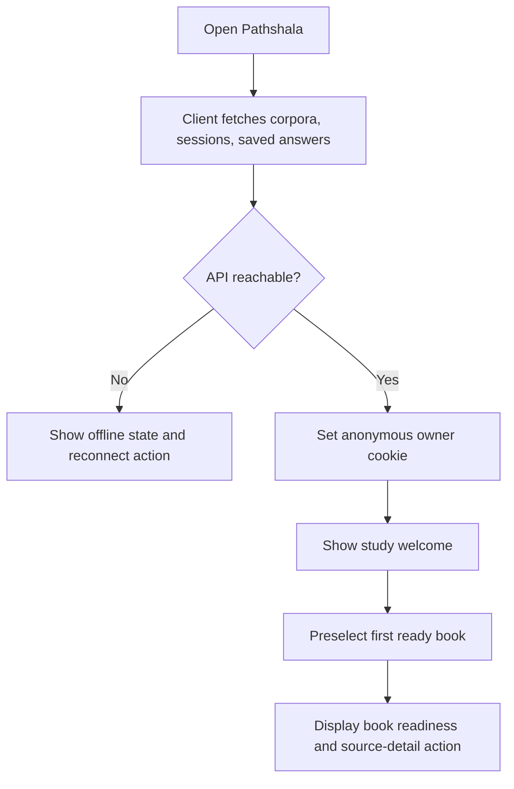
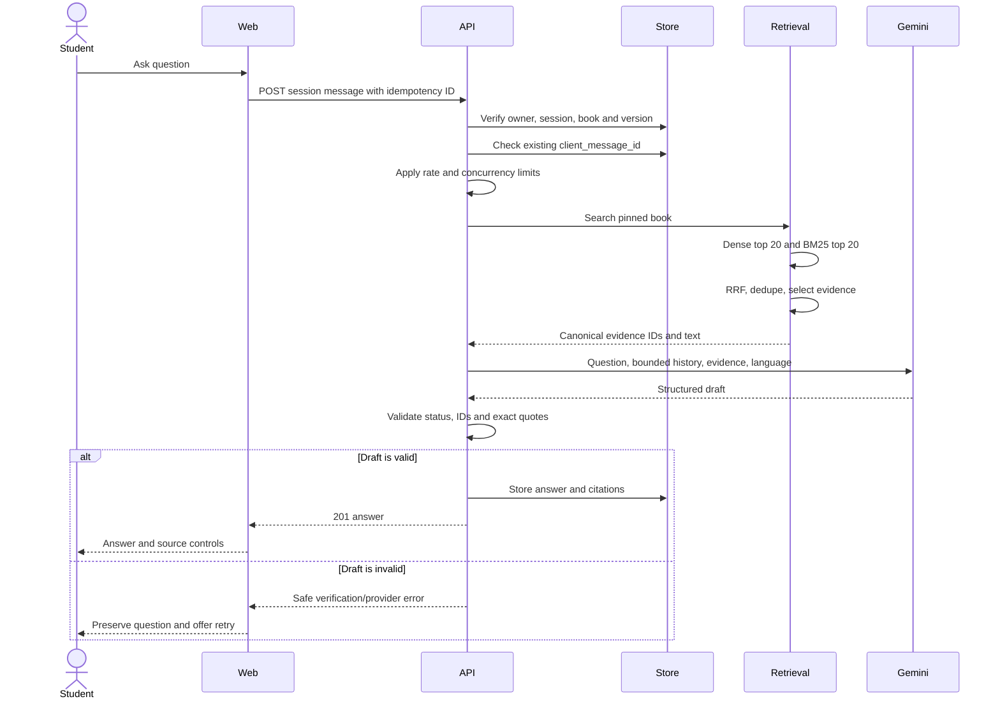
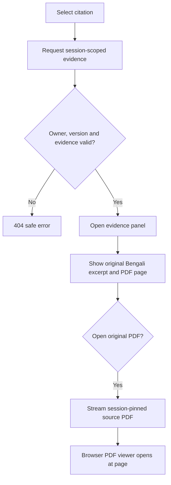
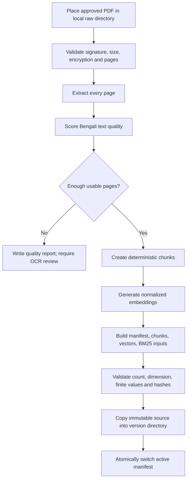
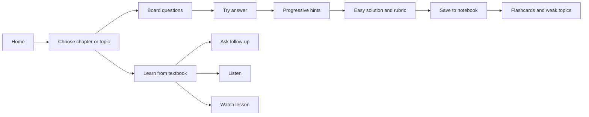
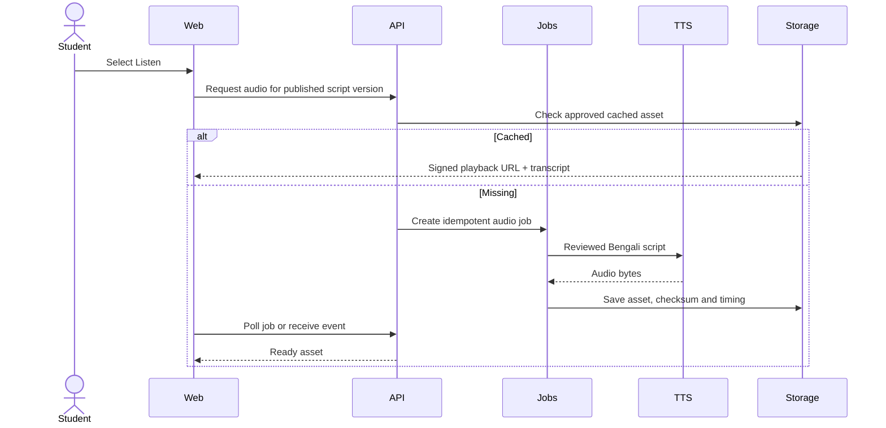

# Pathshala Application Flow

**Version:** 2.0

**Scope:** Student-facing flow, system decisions, error recovery, and corpus administration
**Related documents:** [TRD](TRD.md), [UI/UX](UIUX.md), [Backend schema](BACKEND-SCHEMA.md)

## 1. Navigation model

The application has three primary destinations:

- **Study companion:** start or continue a book-pinned conversation.
- **My library:** inspect the four books, their source status, and readiness.
- **Saved answers:** revisit answers and their original citations.

Recent conversations appear in the persistent desktop sidebar and the mobile navigation drawer. Preferences and “How Pathshala works” are utility dialogs. The student never needs to understand embeddings, vector indexes, or prompt configuration to study.

## 2. First visit and startup

On first load, the client requests the four corpus records, recent owned sessions, and saved answers. The API establishes an anonymous owner using an HTTP-only cookie. The interface preselects a ready book when one exists. If no book is ready, the library remains usable and each book explains that preparation is incomplete.

The application must not create a session merely because a book was selected. It creates the session when the student asks the first question. This avoids empty session records.

## 3. New study conversation

1. The student chooses a book from the welcome screen or library.
2. The UI updates the composer chip and suggested questions.
3. The student selects Auto, বাংলা, or English for the answer language.
4. The student types a question and sends it using the button or Enter. Shift+Enter inserts a line break.
5. The UI keeps the question visible and announces that it is reading the textbook.
6. If no session exists, the client creates one with the selected collection ID.
7. The client creates a message using a browser-generated `client_message_id`.
8. The API retrieves, generates, validates, stores, and returns the answer.
9. The UI renders the outcome and offers citation, copy, save, helpful, and incorrect controls.

The selected book cannot change while a response is in progress. Choosing another book starts a new conversation. A future explicit migration flow may copy the question into a new session, but it must not mutate the source scope of an existing conversation.

## 4. Answer-generation flow

The initial implementation retrieves dense and lexical candidates and fuses them with RRF. Reranking is not required on the first path. The generator sees only a bounded evidence bundle and recent conversation turns. Earlier assistant answers may help resolve references but never count as factual evidence.

## 5. Outcome branches

### Answered

The response contains a concise answer and at least one valid citation. The UI labels it “From your textbook.” Every citation opens evidence from the session’s exact collection and index version.

### Insufficient evidence

The book does not contain enough reliable evidence. The answer explains this in the selected language and contains no citations. The student can rephrase, inspect the book’s coverage, or choose another book in a new conversation.

### Needs clarification

The question is ambiguous, usually because a person, passage, or grammar topic is unclear. The response asks one focused question. The next turn uses bounded recent context to resolve it.

### Book not ready

Session creation returns 503. The UI preserves the typed question, identifies the selected book as being prepared, and provides a route to the library. It never shows this as “no evidence.”

### Provider or verification failure

The API returns 429, 502, 503, or 504 as appropriate. The UI keeps the original question in the composer and offers retry. Retrying reuses the same `client_message_id` unless the text or language changes, preventing duplicate messages after uncertain network completion.

### Concurrent question

The API returns 409 while another response is being created in the same conversation. The composer stays disabled during the local request, but the server also enforces this rule across tabs.

## 6. Citation and PDF flow

The panel displays canonical extracted text, PDF page number, selected book, and an explanation that printed pagination may differ. “Open original PDF” requests the file through the owned session endpoint. The client never constructs a raw filesystem path or public storage URL.

On desktop, the source opens in a right panel. On mobile, it becomes a full-width overlay. Closing it restores focus to the citation that opened it.

## 7. Conversation lifecycle

### Resume

Selecting a recent conversation loads its book, pinned index version, question history, and stored outcomes. If the current active book version has changed, the existing conversation continues against its original version so old citations remain stable.

### Delete

Deleting a conversation removes the session and dependent messages, saves, and feedback. If an answer is in progress, deletion returns 409. The UI should require a compact confirmation once production user accounts or longer retention are introduced. The anonymous MVP can use an undo toast backed by delayed deletion if implemented.

### Expire

Anonymous sessions expire 24 hours after creation. Opening an expired session returns 404. The UI removes it from recent conversations after refreshing and explains that temporary study history has expired.

### Follow-up

Short questions containing anaphoric phrases may be expanded using the last question. If the relation remains unclear, the assistant asks for clarification. Follow-up expansion must not change the pinned book.

## 8. Saved answer flow

1. The student selects Save on an answered or non-answer outcome.
2. The client sends an idempotent PUT with the desired saved state.
3. The API verifies that the message belongs to the owner.
4. The saved collection updates immediately after server success.
5. Opening a saved citation uses the original session ID and version.
6. Deleting its parent conversation removes the saved association.

Saved answers are bookmarks, not a separate factual knowledge base. They must never feed retrieval or model context automatically.

## 9. Feedback flow

Helpful and Incorrect are mutually exclusive current-state ratings. A PUT replaces the previous rating. “Incorrect” should later open an optional category form containing retrieval error, unsupported answer, wrong language, bad source, or other. Feedback is operational data and cannot silently modify the book index or evaluation labels.

## 10. Library flow

Each of the four books shows:

- SSC or HSC, exam year, and paper;
- Bengali title and short description;
- ready, preparing, review required, or unavailable status;
- PDF page and searchable passage counts when ready;
- source, publisher, and syllabus limitation in Book details;
- a Study this book action.

Filtering by SSC/HSC and searching by title happen locally over the four records. Starting study creates a clean local view; the server session appears only after the first question.

## 11. Preferences and privacy flow

The Preferences dialog allows answer-language selection and shows safe runtime details. It explains that questions, bounded recent conversation, and retrieved passages are sent to Gemini. It never reveals credentials, absolute paths, raw prompts, or provider error payloads.

Changing language affects subsequent questions only. It does not regenerate stored answers. A future authenticated profile may persist the preference server-side; the anonymous MVP stores it in browser local storage.

## 12. Ingestion and publication flow

The operator performs visual checks before accepting a corpus. A source page marked for review is excluded until corrected. A failed run leaves the prior active version intact. Indexing is repeated for each of the four book IDs.

## 13. Empty, loading, and recovery states

| State | Message intent | Primary action |
|---|---|---|
| No conversations | Invite the first meaningful question | Focus question composer |
| No saved answers | Explain what saving does | Return to Study companion |
| No search result | Explain the filter mismatch | Clear search or change filter |
| Book preparing | Explain that evidence is not ready | Choose another ready book |
| API offline | Preserve work and identify connection issue | Reconnect |
| Answer loading | Describe the real stage without fake percentages | Wait; prevent duplicate submit |
| Unsupported | State the source limitation | Rephrase or inspect coverage |
| Quota limited | Identify temporary provider constraint | Retry after the indicated period |
| Session expired | Explain temporary retention | Start a new conversation |

## 14. Version 2 student journey

The home screen asks what the student wants to do: continue, learn a topic, practise board questions, or revise. Level and paper persist as context. Board/year filters appear only in practice views.

## 15. Board-question flow

1. Student selects level, paper, chapter/topic and optional board/year/type filters.
2. System displays question wording, marks, source label and past-attempt state.
3. Student starts an untimed or timed attempt.
4. Student can request Hint 1 (concept), Hint 2 (approach), then Hint 3 (key points). Each use is recorded.
5. Student submits or chooses self-check.
6. Evaluation retrieves the question rubric, textbook evidence and approved solution evidence.
7. Result shows matched points, missing points, a suggested answer, sources and score uncertainty.
8. Student retries, saves weak points, or proceeds to the next question.

The system never reveals a supposedly official answer when only a guide solution exists. The visible label and source drawer must say which it is.

## 16. Audio flow

The player includes transcript, speed, 10-second seek, chapter markers, download policy, and source drawer. Failure leaves the text lesson usable.

## 17. Video flow

The student selects Watch lesson. If a reviewed render exists, playback begins with captions enabled by default. Otherwise the UI may offer “Prepare video,” creating one idempotent job. The job renders approved scenes, narration, captions, citations and thumbnail. Failed generation never blocks the text/audio lesson. Students can jump from a video chapter to the cited textbook page or related practice question.

## 18. Editorial flow

Source upload → rights/provenance check → extraction/OCR → taxonomy mapping → question/answer parsing → reviewer correction → index build → retrieval evaluation → publish. Solution generation follows draft → automated citation/schema checks → academic review → publish. Lesson scripts and media follow the same dependency graph; upstream edits mark dependent assets stale and remove them from new recommendations until reviewed.
