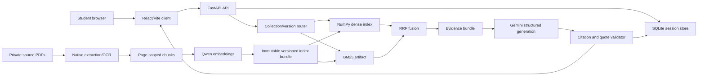

# Architecture

## Purpose

Pathshala is a modular monolith with an offline corpus builder. The application serves a small, immutable four-book corpus through a FastAPI API and a React client. The design keeps extraction, retrieval, generation, validation, and persistence separate so an answer can be traced to a source page and a specific index version.

## System view

## Runtime responsibilities

### Web client

`apps/web/` owns navigation, collection selection, question composition, conversation rendering, evidence inspection, saved answers, feedback, and responsive accessibility behavior. It does not hold provider credentials, perform retrieval, or decide whether an answer is grounded.

### API

`backend/eduapp/app.py` owns HTTP contracts, anonymous owner-cookie assignment, request limits, session routing, concurrency guards, provider error mapping, and static frontend serving. Domain modules keep the implementation boundaries narrow:

| Module | Responsibility |
| --- | --- |
| `config.py` | Environment values, data root, model IDs, and four collection metadata |
| `store.py` | SQLite sessions, messages, saved answers, feedback, ownership, and retention |
| `retrieval.py` | Index loading, Bengali-aware tokenization, dense encoding, BM25, Banglish variants, and RRF |
| `generation.py` | Gemini request, structured response parsing, exact quote validation, and provider errors |
| `ingest.py` | Local extraction, quality gating, deterministic page-scoped chunks, embeddings, and activation |
| `ocr.py` | Local Tesseract OCR fallback |
| `banglish.py` | Romanized Bengali detection and query expansion |

### Offline indexing

The Kaggle builder performs OCR and embedding generation outside the request path. It produces an immutable directory for each collection, an `active.json` pointer, a quality report, and a ZIP archive. The local importer validates the archive before copying it into `data/indexes/`.

## Answer flow

1. The client creates or reuses a session pinned to one collection and corpus version.
2. The API verifies the anonymous owner cookie, input length, session ownership, and per-owner rate limit.
3. Short anaphoric follow-ups are combined with the previous question for retrieval context; recent history is still passed separately to generation.
4. The retrieval layer produces dense and lexical candidate rankings, expands Banglish queries when appropriate, and fuses rankings with reciprocal rank fusion.
5. The generator receives only the question, bounded recent history, requested answer language, and retrieved evidence units.
6. The validator rejects unknown evidence IDs, quotes that do not occur in the retrieved text, and answered responses without citations.
7. The validated result is persisted idempotently using the client message ID and returned with the corpus version, trace ID, and citations.

## Boundaries and invariants

- A session has exactly one collection and one immutable corpus version.
- Retrieval is always scoped to that session; cross-collection fallback is forbidden.
- Textbook evidence is authoritative for the assessment release. Generated explanations, future board questions, and future solutions remain separate source classes.
- The model never receives credentials, filesystem paths, shell tools, or database-write tools.
- An index is not release-ready while `manual_review_complete` is false.
- A provider error is surfaced as an infrastructure error; it must not be represented as insufficient textbook evidence.
- Source PDFs, OCR text, vectors, and model caches remain outside Git.

## Pilot storage and migration seam

The pilot intentionally uses SQLite for session metadata, immutable JSON/NumPy files for corpus data, and in-process BM25. This is appropriate for four small, versioned books and makes the retrieval artifact easy to inspect. The repository keeps the domain identifiers and manifest format independent of this choice so PostgreSQL/pgvector can be introduced later without changing the public API.

## Failure handling

| Failure | Behavior |
| --- | --- |
| Missing or unready collection | Session creation returns `503`; other ready collections remain usable |
| Invalid or incomplete index | Readiness fails and the previous active index remains untouched |
| Gemini timeout/quota error | API returns a bounded `504`/`429`/`503` message with no provider payload |
| Unsupported question | Model returns `insufficient_evidence`; citations are empty |
| Ambiguous question | Model returns `needs_clarification` with one short clarification |
| Duplicate client message | Stored result is returned if the question and language match |
| Concurrent message in one session | API returns `409` rather than corrupting turn order |

## Future extensions

Board questions, official keys, licensed solutions, notebook items, audio, and narrated-slide video must enter through separate source and review workflows. They must carry their own rights status, authority tier, version, and evaluation labels; they are not appended to the textbook index as untyped text.
