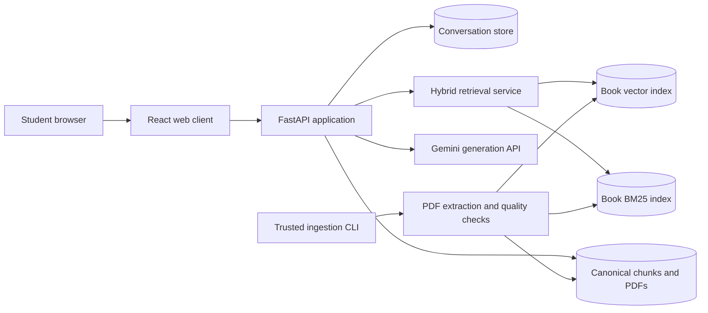

# Pathshala Technical Requirements Document

**Version:** 2.0

**Date:** 12 September 2026

**Status:** Implementation baseline
**Related documents:** [PRD](PRD.md), [Application flow](APP-FLOW.md), [UI/UX specification](UIUX.md), [Backend schema](BACKEND-SCHEMA.md), [Implementation plan](IMPLEMENTATION-PLAN.md)

## 1. Purpose

Pathshala is a bilingual learning application whose authoritative foundation is four PDF books:

1. SSC 2026 Bangla First Paper
2. SSC 2026 Bangla Second Paper
3. HSC 2026 Bangla First Paper
4. HSC 2026 Bangla Second Paper

Students select one book, ask in Bengali or English, receive a concise answer grounded in that book, and inspect the exact supporting passage and PDF page. The application must never blend evidence across books. It must distinguish an unsupported question from a model or infrastructure failure.

This document defines the required system behavior, component boundaries, technical constraints, service levels, security controls, and verification gates. Product intent remains in the PRD.

Version 2 adds separately versioned board questions, licensed solution sources, student attempts, review workflows, notebooks, and generated audio/video. The four textbooks remain the primary authority.

## 2. System context

The initial deployment is a modular monolith. PDF ingestion is an offline trusted command. The browser communicates only with the API; provider credentials are never sent to client code. Four independently versioned indexes share one retrieval implementation and one answer-model adapter.

## 3. Technology baseline

| Area | Local MVP | Production target |
|---|---|---|
| Web | React 19, TypeScript, Vite | Same, served through a hardened edge or application server |
| API | Python 3.12, FastAPI, Pydantic | Multiple stateless API workers behind HTTPS |
| Conversation data | SQLite with WAL | PostgreSQL with migrations and connection pooling |
| Vector storage | Versioned NumPy arrays, exact cosine search | pgvector exact search; HNSW only if measurement requires it |
| Lexical retrieval | `rank-bm25`, immutable per-book artifact | Same algorithm; persisted artifact or search service with verified BM25 semantics |
| Embeddings | Qwen3-Embedding-0.6B, 1024 dimensions | Same candidate after Bengali evaluation; BGE-M3 remains the comparison baseline |
| Generation | Gemini 3.5 Flash-Lite | Provider adapter with pinned model version and controlled fallback |
| PDF extraction | PyMuPDF native text extraction | Native extraction plus reviewed OCR fallback for unusable pages |
| Packaging | Python virtual environment and pnpm lockfile | Containers with pinned runtime and dependency locks |
| Observability | Structured application logs | OpenTelemetry traces, metrics, alerts, and redaction |

The current repository contains implementation work for the local MVP. Production choices are requirements for hardening, not claims about the present code.

## 4. Functional requirements

### 4.1 Corpus and collection requirements

| ID | Requirement |
|---|---|
| COR-001 | The system shall expose exactly four active logical book collections for this release. |
| COR-002 | Every session shall be pinned to one `collection_id` and one immutable `index_version`. |
| COR-003 | Dense retrieval, BM25 retrieval, reranking, cache lookup, evidence lookup, and citation validation shall apply the pinned book filter. |
| COR-004 | Each source file shall have a SHA-256 hash, source URL or provenance note, byte size, PDF page count, and edition-verification status. |
| COR-005 | An incomplete or failed index shall never replace a ready index. Activation shall be atomic. |
| COR-006 | A page that fails text-quality checks shall be quarantined until reviewed or OCR-processed. It shall not silently enter retrieval. |
| COR-007 | The application shall display limitations where a chosen book does not cover the complete examination syllabus. |

### 4.2 Ingestion requirements

| ID | Requirement |
|---|---|
| ING-001 | The ingestion CLI shall accept only an enumerated book identifier and a locally controlled PDF path. |
| ING-002 | Files shall be limited to 100 MB and 1,000 pages by default, with PDF signature and encryption checks. |
| ING-003 | Native extraction shall preserve PDF page numbers and canonical source text. |
| ING-004 | Bengali Unicode shall be normalized to NFC without deleting vowel signs, combining marks, punctuation, or meaningful paragraph boundaries. |
| ING-005 | Chunking shall begin at document structure boundaries and shall never cross PDF pages in the MVP, preserving simple citation mapping. |
| ING-006 | The initial child-chunk target shall be 350 embedding tokens, with a 500-token hard ceiling and sentence-boundary splitting where possible. |
| ING-007 | Second-paper grammar chunks shall preserve a rule with its examples and exceptions where the PDF structure allows it. |
| ING-008 | Chunk identifiers shall be deterministic for identical source bytes and pipeline configuration. |
| ING-009 | Document embeddings shall be L2-normalized and validated for finite values, count, and dimensions before activation. |
| ING-010 | The manifest shall pin extraction version, chunking version, embedding model identifier, vector dimension, and source hash. |

### 4.3 Retrieval requirements

| ID | Requirement |
|---|---|
| RET-001 | The normal path shall run dense and BM25 retrieval over the same book version. |
| RET-002 | Dense search shall retrieve 20 candidates using normalized-vector cosine similarity. |
| RET-003 | BM25 shall retrieve up to 20 candidates using a Unicode-aware tokenizer that preserves Bengali combining marks. |
| RET-004 | Ranked lists shall be combined with reciprocal rank fusion using `1 / (60 + rank)`. |
| RET-005 | Fusion shall deduplicate by immutable chunk ID and use deterministic tie-breaking. |
| RET-006 | The initial answer context shall contain three to five evidence units within the configured token budget. |
| RET-007 | Query rewriting shall be skipped for standalone questions. A bounded recent-turn expansion may be used for clear follow-ups. |
| RET-008 | Reranking shall remain optional until a controlled evaluation demonstrates enough quality gain to justify latency. |
| RET-009 | No similarity or reranker score shall be presented as a calibrated probability of correctness. |
| RET-010 | A request may perform at most two retrieval passes. Exhaustion shall result in clarification or abstention. |

### 4.4 Generation and answer requirements

| ID | Requirement |
|---|---|
| GEN-001 | Generation shall use only evidence supplied by the retrieval service. |
| GEN-002 | The generator shall return structured output with `status`, `answer`, and `citations`. |
| GEN-003 | Valid statuses shall be `answered`, `insufficient_evidence`, and `needs_clarification`. Provider failures shall use HTTP errors rather than a semantic answer status. |
| GEN-004 | Every factual answer shall contain at least one server-verifiable citation. |
| GEN-005 | Each citation quote shall be a normalized exact substring of a supplied evidence chunk. |
| GEN-006 | The server shall resolve page metadata from the evidence store. Model-produced page numbers shall not be trusted. |
| GEN-007 | Bengali questions shall default to Bengali answers; English questions shall default to English. An explicit user preference shall override automatic detection. |
| GEN-008 | Newly composed grammar examples shall be labeled as generated examples and shall cite only the supporting rule. |
| GEN-009 | The normal request shall target one hosted generation call. All rewrites, repairs, and escalations together shall remain within a three-call ceiling. |
| GEN-010 | The model shall have no browser, shell, database-write, or secret-access tool. PDF text shall be treated as untrusted data. |

### 4.5 Conversation requirements

| ID | Requirement |
|---|---|
| CON-001 | An anonymous owner token shall be generated server-side and stored in an HTTP-only, SameSite cookie. |
| CON-002 | Every session, message, citation, save, feedback record, and PDF request shall be checked against the current owner. |
| CON-003 | A session shall retain at most six complete prior turns and 1,500 history tokens for model context. |
| CON-004 | Conversation statements shall never become textbook evidence or enter the corpus index. |
| CON-005 | `client_message_id` shall make message creation idempotent within a session. Reuse with different input shall return 409. |
| CON-006 | Only one answer may be generated concurrently per session. A concurrent turn shall return 409. |
| CON-007 | Anonymous sessions shall expire after 24 hours in the MVP. |
| CON-008 | Deleting a conversation shall remove active messages, saved associations, and feedback through referential actions. |

### 4.6 API and interface requirements

| ID | Requirement |
|---|---|
| API-001 | Public application endpoints shall use `/api/v1`. Health probes remain under `/health`. |
| API-002 | Request fields shall be validated by typed schemas. Question text shall be 1–2,000 Unicode characters. |
| API-003 | Resource endpoints shall use nouns and correct HTTP semantics. |
| API-004 | Expected status codes include 201 for created resources, 204 for deletion, 404 for inaccessible resources, 409 for state conflicts, 422 for semantic validation, 429 for rate limits, 502/504 for provider errors, and 503 for unready books. |
| API-005 | API errors shall use a stable machine-readable error code and safe user message in the production contract. Stack traces and provider response bodies shall never reach clients. |
| API-006 | The application shall provide OpenAPI documentation generated from the active API schemas. |
| UI-001 | The library shall expose all four books and their readiness state. |
| UI-002 | The question composer shall expose Bengali, English, and automatic answer-language selection. |
| UI-003 | Answers shall distinguish source-grounded, clarification, unsupported, and infrastructure-error states. |
| UI-004 | Selecting a citation shall open canonical source text and the correct PDF page. |
| UI-005 | Users shall be able to create, revisit, delete, save, copy, and rate answers through working controls. |
| UI-006 | The interface shall remain usable at 320 CSS pixels, 200% browser zoom, and with keyboard-only navigation. |

## 5. API surface

| Method | Endpoint | Purpose | Success |
|---|---|---|---|
| GET | `/health/live` | Process liveness | 200 |
| GET | `/health/ready` | Ready book indexes | 200 or 503 |
| GET | `/api/v1/status` | Safe runtime capability summary | 200 |
| GET | `/api/v1/corpora` | Four books and readiness metadata | 200 |
| GET | `/api/v1/sessions` | Owned recent conversations | 200 |
| POST | `/api/v1/sessions` | Create a book-pinned session | 201 |
| GET | `/api/v1/sessions/{session_id}/messages` | Load owned history | 200 |
| POST | `/api/v1/sessions/{session_id}/messages` | Ask and receive a verified answer | 201 |
| DELETE | `/api/v1/sessions/{session_id}` | Delete conversation | 204 |
| GET | `/api/v1/sessions/{session_id}/evidence/{evidence_id}` | Load owned evidence | 200 |
| GET | `/api/v1/sessions/{session_id}/pdf` | Stream the pinned source PDF | 200 |
| GET | `/api/v1/saved` | Load owned saved answers | 200 |
| PUT | `/api/v1/messages/{message_id}/saved` | Set saved state idempotently | 200 |
| PUT | `/api/v1/messages/{message_id}/feedback` | Set answer rating idempotently | 200 |

The exact request, response, and persistence fields are specified in [Backend schema](BACKEND-SCHEMA.md).

## 6. Non-functional requirements

### 6.1 Performance and capacity

| ID | Target | Measurement |
|---|---|---|
| NFR-P01 | Warm p50 answer latency ≤ 5 seconds | 200 requests on the named reference system |
| NFR-P02 | Warm p95 answer latency ≤ 10 seconds at 10 concurrent users | Load test with provider timing separated |
| NFR-P03 | Retrieval p95 ≤ 500 milliseconds after models and index are warm | Per-stage trace timing |
| NFR-P04 | Initial page content becomes visible within 2.5 seconds on a throttled mid-range mobile profile | Browser performance run |
| NFR-P05 | API shall reject overload before exhausting memory | Bounded generation semaphore and 503 outcome |
| NFR-P06 | The MVP shall support all four exact indexes in local storage without approximate search | Index-size and latency report |

### 6.2 Reliability and data integrity

- The API shall provide valid semantic or infrastructure outcomes for at least 99% of requests during the agreed load run.
- Index activation shall be an atomic pointer change after manifest and artifact validation.
- All stored citations shall continue to resolve against the pinned retired index until their sessions expire.
- Database foreign-key enforcement shall be active for every connection.
- Re-ingesting the same source and configuration shall produce the same version and chunk IDs.
- Backup and restore procedures are required before production use.

### 6.3 Retrieval and answer quality

Targets apply per book and language, not only to pooled results:

- Passage Recall@5 ≥ 0.90 on answerable held-out cases.
- Answer correctness ≥ 0.85 on answerable cases.
- Supported factual claims ≥ 0.95.
- Citation ID integrity = 1.00.
- Citation support ≥ 0.95 by bilingual review.
- Abstention recall ≥ 0.90 on unanswerable cases.
- Over-abstention ≤ 0.10 on answerable cases.
- Answer-language compliance ≥ 0.95.

These are release gates. They have not yet been measured.

### 6.4 Accessibility

The target is WCAG 2.2 AA for the student experience. The implementation must provide semantic landmarks, associated form labels, visible focus, minimum 44-pixel touch targets for primary mobile actions, appropriate live regions for answer progress, reduced-motion support, adequate color contrast, and correct focus restoration when closing the evidence panel. Bengali glyphs must not clip at supported zoom levels.

## 7. Security and privacy requirements

### 7.1 Secrets

- `GEMINI_API_KEY` and `HUGGINGFACE_API_KEY` shall exist only in server-side environment configuration.
- Secret files shall be ignored by Git and restricted to the current user.
- No secret value shall appear in logs, API responses, client bundles, screenshots, fixtures, documentation, or error messages.
- Credentials pasted into collaboration channels shall be rotated before any public deployment.

### 7.2 Application security

- All SQL shall use parameterized bindings.
- HTML generated by users or models shall never be inserted through raw HTML APIs.
- State-changing browser requests shall enforce same-origin policy. Production shall also use HTTPS, secure cookies, and an explicit CSRF strategy.
- Hosts, origins, body size, question length, PDF size, page count, generation concurrency, and requests per minute shall be bounded.
- PDFs are untrusted files. Extraction shall occur without network access or active-content execution and under memory and time limits.
- Retrieved text is untrusted prompt data. Instructions inside it shall not override system policy.
- Evidence endpoints shall validate owner, session, collection, version, and evidence membership.
- Production responses shall include a strict Content Security Policy, `X-Content-Type-Options`, frame protection, and a restrictive referrer policy.

### 7.3 Privacy

- Anonymous conversations are retained for 24 hours by default.
- Routine telemetry shall record trace ID, timings, versions, counts, and outcome codes without full question or answer text.
- Google receives the question, bounded recent history, and retrieved evidence to generate an answer. The preferences screen shall disclose this plainly.
- Feedback shall not become training data or source evidence automatically.
- Production deletion and backup-retention behavior shall be documented before launch.

## 8. Observability

Every answer trace shall include the following internal attributes without secrets or source text:

- trace ID, session ID hash, collection ID, and index version;
- embedding, reranker, and generation model identifiers;
- candidate counts for dense, BM25, fusion, reranking, and final evidence;
- retrieval, queue, provider, validation, and total duration;
- input and output token counts where the provider exposes them;
- outcome status, retry count, and safe failure code;
- cited evidence IDs and pages for debugging, subject to retention policy.

Operational dashboards shall report latency percentiles, provider error rate, index readiness, request rate, queue rejection, unsupported-answer rate, and cost per successful supported answer.

## 9. Environments and configuration

| Environment | Data | Provider | Cookie mode | Purpose |
|---|---|---|---|---|
| Test | Synthetic fixtures only | Stubbed | Insecure localhost | Deterministic unit and integration tests |
| Local | Four locally stored PDFs | Gemini sandbox/developer account | HTTP-only, SameSite; secure off | Developer and reviewer use |
| Staging | Licensed copies and non-production conversations | Separate provider key | Secure HTTPS | Release validation and load testing |
| Production | Approved corpus versions | Production provider account | Secure HTTPS | Student use |

Configuration shall be validated at startup. Model IDs, data directories, cookie security, allowed hosts, allowed origins, retention, limits, and index versions shall be explicit. A missing generation credential shall leave corpus inspection available while answer creation reports a safe unavailable state.

## 10. Delivery and quality gates

A release is technically ready only when:

1. Four source manifests are reviewed and each ready collection has a validated active index.
2. Extraction quality is sampled visually and pages requiring OCR are resolved or explicitly excluded.
3. Unit, integration, API contract, retrieval, security, accessibility, and browser checks pass from a clean environment.
4. The bilingual evaluation reports per-book results and includes all failures.
5. Gemini calls succeed with the pinned model and structured-output validation.
6. No credential or raw private corpus artifact appears in Git history.
7. Load, failure-injection, backup, and restore exercises meet the defined gates.
8. The README contains tested setup commands and measured limitations.

## 11. Constraints and open decisions

- The downloaded HSC Second Paper source is a Bangladesh Open University book and is not yet verified as equivalent to the general-board HSC 2026 syllabus.
- HSC First Paper may require `সহপাঠ` for full syllabus coverage, but the user limited this release to four books. The interface must disclose any resulting gap.
- Native extraction quality has not yet been reviewed across all four PDFs.
- Qwen3-Embedding-0.6B and BGE-M3 have not yet been compared on the Bengali evaluation set.
- The current local store is SQLite. PostgreSQL and pgvector are production requirements after the MVP behavior is stable.
- A reranker is intentionally absent from the first online path until an ablation demonstrates value.

## 12. Version 2 technical requirements

### 12.1 Content and retrieval

| ID | Requirement |
|---|---|
| CNT-001 | Every source shall have type, authority tier, rights status, checksum, edition/year, and provenance. |
| CNT-002 | Board questions shall store board, year, level, paper, question type, marks, topic and printed order as structured fields. |
| CNT-003 | Commercial solution/test-paper content shall not be made searchable or distributable until rights status is approved. |
| RET-101 | Query filters shall constrain level, paper, board, year, topic and source type before fusion. |
| RET-102 | Textbook, official question/key, guide solution and generated explanation evidence shall remain distinguishable in results and citations. |
| RET-103 | Retrieval shall favor Tier A/B sources when evidence conflicts, while still showing labeled alternates. |
| RET-104 | MCQ lookup, exact board-question lookup, explanatory QA and answer evaluation shall use separate retrieval profiles. |
| RET-105 | Published generated content shall never become self-validating evidence; it must retain upstream A-C citations. |

### 12.2 Practice and solutions

| ID | Requirement |
|---|---|
| PRC-001 | Students shall be able to attempt a question before revealing hints or solutions. |
| PRC-002 | Attempts shall record duration, hint usage, response revision and rubric result. |
| PRC-003 | Scoring shall return rubric-point evidence and uncertainty; “official score” is forbidden without a validated official rubric. |
| SOL-001 | Easy solutions shall use a typed schema: interpretation, concepts, steps, model answer, marking points, mistakes and revision answer. |
| SOL-002 | Solutions and scripts shall support draft, in_review, published, rejected and stale states. |
| SOL-003 | Only reviewer-approved content shall be shown as a published editorial solution. |

### 12.3 Media

| ID | Requirement |
|---|---|
| MED-001 | Audio/video generation shall consume a reviewed, immutable lesson-script version. |
| MED-002 | Audio shall include transcript, language, voice, duration, checksum and source citations. |
| MED-003 | Video shall include captions, chapters/scenes, transcript, source credits and an audio-only alternative. |
| MED-004 | Media jobs shall be asynchronous, idempotent, retryable and observable. |
| MED-005 | Object storage URLs shall be short-lived signed URLs or public CDN URLs only for approved public assets. |
| MED-006 | Generated media shall remain unpublished when rights, citation or review gates fail. |

### 12.4 Accounts, privacy and security

| ID | Requirement |
|---|---|
| IAM-101 | Anonymous local study may remain available; cloud sync, progress and publishing require authenticated accounts. |
| IAM-102 | Reviewer/editor/admin operations shall require server-enforced roles and audit records. |
| SEC-101 | Uploads shall use allowlisted formats, byte limits, malware scanning, isolated processing and immutable source hashes. |
| SEC-102 | Provider keys shall exist only in server/worker secret stores and shall never enter media metadata or client logs. |
| SEC-103 | Student notes and attempts shall be private by default and excluded from shared retrieval indexes. |
| SEC-104 | Account deletion and retention jobs shall cover attempts, notebook items and private generated media. |

### 12.5 Service objectives

| Operation | Initial objective |
|---|---|
| Question/filter browse | p95 under 500 ms excluding uncached media |
| Grounded text answer | p95 under 12 seconds |
| Cached audio playback start | p95 under 2 seconds on broadband |
| New audio generation | 95% completed within 90 seconds |
| New narrated-slide lesson | 95% completed within 10 minutes |
| Job status | Eventual consistency within 5 seconds |

Media objectives are measured by provider, language, asset duration and cache state.
