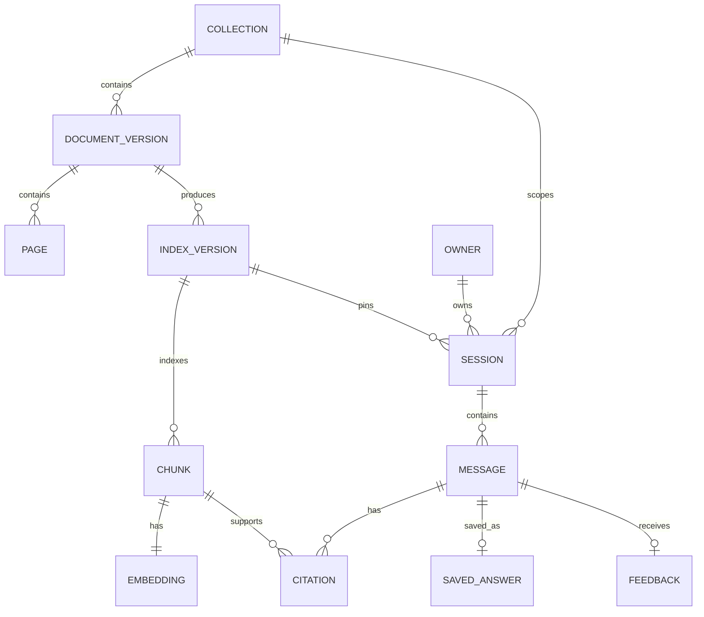

# Pathshala Backend and Data Schema

**Version:** 1.0

**Purpose:** Define API objects, persistence entities, index artifacts, invariants, and migration path
**Related documents:** [TRD](TRD.md), [Application flow](APP-FLOW.md)

## 1. Architecture boundaries

The backend is organized into six modules:

| Module | Responsibility | Must not own |
|---|---|---|
| API | HTTP validation, ownership, status mapping, response serialization | Retrieval algorithms or provider-specific prompts |
| Conversation | Session lifecycle, idempotency, bounded history, saves and feedback | Corpus mutation |
| Retrieval | Query encoding, dense/BM25 search, fusion, optional reranking | User ownership or answer wording |
| Generation | Provider request, structured output, citation validation | Selecting a different book or accepting model page numbers |
| Ingestion | PDF validation, extraction, normalization, chunking, embedding, activation | Public arbitrary uploads in the MVP |
| Storage | Parameterized persistence, transactions, immutable artifact lookup | Business decisions based on answer text |

Dependencies point inward through typed interfaces. The API orchestrates application services. Provider and persistence implementations remain replaceable.

## 2. Domain model



The local MVP materializes user data in SQLite and corpus data in immutable JSON/NumPy/PDF directories. The production target moves relational entities to PostgreSQL and vectors to pgvector while preserving domain identifiers.

## 3. Production relational schema

### 3.1 `collections`

| Column | Type | Constraint |
|---|---|---|
| `id` | text | Primary key; enumerated four collection IDs |
| `exam_level` | text | `SSC` or `HSC` |
| `exam_year` | smallint | `2026` for this release |
| `paper` | smallint | 1 or 2 |
| `title_bn` | text | Non-empty |
| `title_en` | text | Non-empty |
| `description_bn` | text | Non-empty |
| `source_note` | text | Provenance and coverage disclosure |
| `created_at` | timestamptz | Server generated |

Unique constraint: `(exam_level, exam_year, paper)`.

### 3.2 `document_versions`

| Column | Type | Constraint |
|---|---|---|
| `id` | uuid | Primary key |
| `collection_id` | text | Foreign key to `collections` |
| `source_sha256` | char(64) | Valid lowercase hexadecimal |
| `source_url` | text | Provenance only; never fetched during public requests |
| `publisher` | text | Nullable until verified |
| `edition` | text | Nullable until verified |
| `syllabus_version` | text | Nullable until verified |
| `edition_verified` | boolean | Default false |
| `byte_size` | bigint | Positive, ≤ configured limit |
| `page_count` | integer | Positive, ≤ configured limit |
| `rights_note` | text | Required before public redistribution |
| `created_at` | timestamptz | Server generated |

Unique constraint: `(collection_id, source_sha256)`. Source bytes are immutable after insert.

### 3.3 `pages`

| Column | Type | Constraint |
|---|---|---|
| `id` | uuid | Primary key |
| `document_version_id` | uuid | Foreign key |
| `pdf_page` | integer | One-based, positive |
| `printed_page` | text | Nullable |
| `raw_text` | text | Native or OCR output |
| `canonical_text` | text | Reviewed normalized evidence text |
| `extraction_method` | text | `native`, `ocr`, or `manual_review` |
| `quality_status` | text | `ok`, `review_required`, `excluded` |
| `bengali_character_count` | integer | Non-negative diagnostic |
| `quality_metrics` | jsonb | Versioned diagnostics, no secrets |

Unique constraint: `(document_version_id, pdf_page)`.

### 3.4 `index_versions`

| Column | Type | Constraint |
|---|---|---|
| `id` | text | Content/config-derived primary key |
| `collection_id` | text | Foreign key |
| `document_version_id` | uuid | Foreign key |
| `state` | text | State machine value |
| `extractor_version` | text | Required |
| `normalizer_version` | text | Required |
| `chunker_version` | text | Required |
| `embedding_model` | text | Required |
| `embedding_revision` | text | Required in production |
| `embedding_dimensions` | integer | 1–4096 |
| `bm25_tokenizer_version` | text | Required |
| `chunk_count` | integer | Non-negative |
| `manifest_sha256` | char(64) | Required once ready |
| `created_at` | timestamptz | Server generated |
| `activated_at` | timestamptz | Nullable |

Allowed transition:

```text
created -> extracting -> review_required
                    \-> chunking -> embedding -> validating -> ready -> active -> retired
any nonterminal build state -> failed
review_required -> extracting
```

At most one active index exists per collection. A transaction retires the previous version and activates the new version.

### 3.5 `chunks`

| Column | Type | Constraint |
|---|---|---|
| `id` | text | Deterministic primary key |
| `index_version_id` | text | Foreign key |
| `page_id` | uuid | Foreign key |
| `parent_id` | text | Nullable self-reference |
| `ordinal` | integer | Non-negative |
| `content_type` | text | `prose`, `poetry`, `grammar_rule`, `example`, `exercise`, `other` |
| `heading_path` | text[] | Ordered source headings |
| `canonical_text` | text | Non-empty, citable |
| `search_text` | text | Context prefix plus canonical text |
| `token_count` | integer | Positive and within configured ceiling |
| `start_offset` | integer | Non-negative canonical-page offset |
| `end_offset` | integer | Greater than start offset |
| `text_sha256` | char(64) | Required |

Index: `(index_version_id, ordinal)`. Every chunk belongs to exactly one page in the MVP; a future span table may support multi-page chunks.

### 3.6 `embeddings`

| Column | Type | Constraint |
|---|---|---|
| `chunk_id` | text | Primary key and foreign key |
| `model_id` | text | Required |
| `model_revision` | text | Required |
| `dimensions` | integer | Must match index version |
| `embedding` | vector(1024) | Finite normalized values |

Do not mix vectors from different models or revisions in one index. Approximate indexes are optional and created only after exact-search comparison.

### 3.7 `owners`

The anonymous MVP represents an owner as a random 256-bit token held in a cookie and stores the token or a hash in each session. Production should store only `owner_token_hash` using a server-side keyed hash.

| Column | Type | Constraint |
|---|---|---|
| `id` | uuid | Primary key |
| `owner_token_hash` | bytea | Unique, never returned |
| `created_at` | timestamptz | Server generated |
| `expires_at` | timestamptz | Required |

### 3.8 `sessions`

| Column | Type | Constraint |
|---|---|---|
| `id` | uuid | Primary key, unguessable |
| `owner_id` | uuid | Foreign key |
| `collection_id` | text | Foreign key |
| `index_version_id` | text | Foreign key; immutable after creation |
| `title` | text | Non-empty, bounded |
| `created_at` | timestamptz | Server generated |
| `updated_at` | timestamptz | Server generated |
| `expires_at` | timestamptz | Required |

Index: `(owner_id, updated_at desc)`. The collection must match the pinned index collection; enforce with a composite key or trigger.

### 3.9 `messages`

| Column | Type | Constraint |
|---|---|---|
| `id` | uuid | Primary key |
| `session_id` | uuid | Foreign key, cascade delete |
| `client_message_id` | uuid | Required |
| `sequence` | integer | Positive, unique per session |
| `question` | text | 1–2,000 characters |
| `answer_language` | text | `auto`, `bn`, or `en` request value |
| `resolved_language` | text | `bn` or `en` |
| `status` | text | Semantic answer status |
| `answer` | text | Non-empty safe text |
| `trace_id` | uuid | Unique |
| `elapsed_ms` | integer | Non-negative |
| `model_id` | text | Pinned generator identifier |
| `prompt_version` | text | Required |
| `created_at` | timestamptz | Server generated |

Unique constraints: `(session_id, client_message_id)`, `(session_id, sequence)`, and `trace_id`.

### 3.10 `citations`

| Column | Type | Constraint |
|---|---|---|
| `id` | uuid | Primary key |
| `message_id` | uuid | Foreign key, cascade delete |
| `chunk_id` | text | Foreign key |
| `ordinal` | integer | Positive, unique per message |
| `quote` | text | Non-empty normalized exact substring |
| `quote_start` | integer | Nullable resolved chunk offset |
| `quote_end` | integer | Nullable, greater than start |

Invariant: cited chunk’s index version must equal the message session’s pinned index version. Enforce in the service transaction and verify with a database constraint or trigger where practical.

### 3.11 `saved_answers`

| Column | Type | Constraint |
|---|---|---|
| `owner_id` | uuid | Foreign key, cascade delete |
| `message_id` | uuid | Foreign key, cascade delete |
| `created_at` | timestamptz | Server generated |

Primary key: `(owner_id, message_id)`. The service verifies that the message’s session belongs to the same owner.

### 3.12 `feedback`

| Column | Type | Constraint |
|---|---|---|
| `owner_id` | uuid | Foreign key, cascade delete |
| `message_id` | uuid | Foreign key, cascade delete |
| `rating` | text | `helpful` or `incorrect` |
| `category` | text | Nullable controlled vocabulary |
| `comment` | text | Nullable, bounded |
| `created_at` | timestamptz | Server generated |
| `updated_at` | timestamptz | Server generated |

Primary key: `(owner_id, message_id)`. Feedback is operational data and is never joined into retrieval.

## 4. Local MVP storage

The in-progress code currently uses these SQLite tables:

```sql
sessions(id, owner, book_id, version, title, created)
messages(id, session_id, client_id, question, language, result, created)
saved(owner, message_id)
feedback(owner, message_id, rating)
```

The complete answer is stored as JSON in `messages.result`. Corpus versions live under:

```text
data/indexes/{book_id}/
├── active.json
├── quality.json
└── {version}/
    ├── manifest.json
    ├── pages.json
    ├── chunks.json
    ├── vectors.npy
    └── source.pdf
```

This format is acceptable for the local assessment MVP because each index is immutable and small. It is not the final production schema. Before multi-worker deployment, migrate message fields and citations into normalized PostgreSQL tables and make session concurrency a database-backed transaction or distributed lock.

## 5. API object schemas

### 5.1 Corpus

```json
{
  "id": "ssc-2026-bangla-1",
  "level": "SSC",
  "paper": 1,
  "title": "বাংলা সাহিত্য",
  "status": "ready",
  "pages": 265,
  "chunks": 1840,
  "version": "content-derived-version",
  "pdf_available": true,
  "source_note": "Source and coverage disclosure"
}
```

Valid status vocabulary should become `ready`, `preparing`, `review_required`, and `unavailable`. The current implementation’s `needs_index` maps to `preparing` at the UI boundary.

### 5.2 Create session

Request:

```json
{
  "collection_id": "hsc-2026-bangla-1"
}
```

Response, 201:

```json
{
  "id": "c74767df-00d0-45d4-95d3-7cf58f250f9a",
  "book_id": "hsc-2026-bangla-1",
  "version": "4bf1040d691f8f5b207f"
}
```

### 5.3 Create message

Request:

```json
{
  "text": "বিয়ের সময় কল্যাণীর প্রকৃত বয়স কত ছিল?",
  "answer_language": "bn",
  "client_message_id": "2a93054b-2ad5-4b5a-9efe-bae2648327a0"
}
```

Answered response, 201:

```json
{
  "id": "b855f9c8-10b1-416e-8ac5-8339fac8ce72",
  "book_id": "hsc-2026-bangla-1",
  "version": "4bf1040d691f8f5b207f",
  "status": "answered",
  "answer": "কল্যাণীর প্রকৃত বয়স ছিল ১৫ বছর।",
  "answer_language": "bn",
  "citations": [
    {
      "evidence_id": "d443b70887e8b80c54fef347",
      "page": 42,
      "quote": "কল্যাণীর বয়স তখন পনেরো"
    }
  ],
  "trace_id": "f69fef1d-822c-40c4-9fc4-004a8310336d",
  "elapsed_ms": 2635
}
```

This is a contract example, not a measured response or verified page number. Real documentation shall replace it with actual source evidence after ingestion review.

### 5.4 Evidence

```json
{
  "id": "d443b70887e8b80c54fef347",
  "book_id": "hsc-2026-bangla-1",
  "version": "4bf1040d691f8f5b207f",
  "page": 42,
  "text": "Canonical original excerpt...",
  "pdf_url": "/api/v1/sessions/{session_id}/pdf#page=42"
}
```

### 5.5 Standard production error

```json
{
  "error": {
    "code": "corpus_not_ready",
    "message": "This textbook is still being prepared.",
    "trace_id": "f69fef1d-822c-40c4-9fc4-004a8310336d",
    "details": []
  }
}
```

The current FastAPI implementation returns the framework’s `detail` shape. Normalizing errors to this envelope is an implementation task before the API is declared stable.

## 6. Retrieval interfaces

```python
class RetrievalCandidate(TypedDict):
    chunk_id: str
    dense_score: float
    lexical_score: float
    dense_rank: int | None
    lexical_rank: int | None
    fused_score: float

class EvidenceUnit(TypedDict):
    evidence_id: str
    book_id: str
    index_version: str
    pdf_page: int
    printed_page: str | None
    canonical_text: str

def retrieve(
    *,
    book_id: str,
    index_version: str,
    question: str,
    limit: int = 5,
) -> list[EvidenceUnit]: ...
```

Query and document encodings must follow the chosen model card independently. Even if Qwen and BGE produce 1024-dimensional vectors, their spaces are incompatible and require separate index versions.

## 7. Transaction boundaries

### Message creation

1. Resolve owner and lock the session.
2. Load session by owner and verify it has not expired.
3. Check `(session_id, client_message_id)`.
4. Perform retrieval and generation outside a long database write transaction.
5. Validate answer and citations.
6. Start a transaction, re-check idempotency, allocate sequence, insert message and citations, and update session title/timestamp.
7. Commit and return the stored representation.

Provider calls must not hold a database write lock. A production distributed lock or pending-message state is required across workers.

### Index activation

1. Build a new immutable version.
2. Verify page, chunk, vector, BM25, and source checksums.
3. Mark version ready.
4. In one transaction, retire the previous active version and activate the new one.
5. Clear or version retrieval caches.

## 8. Retention and deletion

| Data | MVP retention | Production requirement |
|---|---|---|
| Anonymous session and messages | 24 hours | Configurable; disclose and enforce |
| Saved answer | Limited by parent session in MVP | User-controlled account retention if authentication is added |
| Feedback | Limited by parent session in MVP | Defined product retention and deletion workflow |
| Active index | Until replaced | Retain while referenced by sessions or audit records |
| Retired index | Until no live reference remains | Policy-driven purge after verification |
| Routine traces | Not yet persisted | Short fixed retention with content redaction |
| Source PDFs | Local indefinite | Rights-approved retention and access control |

## 9. Migration requirements

1. Introduce a migration tool before the second schema revision.
2. Add explicit message columns and normalized citations to SQLite or migrate directly to PostgreSQL.
3. Store hashed owner tokens instead of raw tokens.
4. Add `updated_at`, `expires_at`, sequence, model revision, prompt version, and safe failure code.
5. Add production collection and document-version tables.
6. Move vectors to pgvector only after parity tests compare results with the NumPy baseline.
7. Preserve old session and citation behavior through the migration or declare local data disposable before release.

## 10. Schema verification

- Foreign keys are active on every connection.
- Every query is parameterized.
- Cross-owner session, message, evidence, saved, feedback, and PDF requests return 404.
- The same client message ID with the same input returns the stored result; changed input returns 409.
- Citation IDs outside the supplied evidence fail validation.
- Citation quotes not found in canonical text fail validation.
- A collection cannot activate two versions simultaneously.
- An index/model mismatch fails readiness and retrieval.
- Deleting a session cascades to messages, citations, saves, and feedback.
- Expired sessions are inaccessible and eventually purged.
